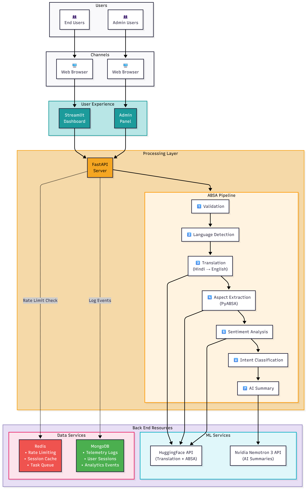

# 🔍 Insights — Aspect-Based Sentiment Analysis Platform

<div align="center">


**A production-grade NLP system for extracting actionable insights from product reviews using Aspect-Based Sentiment Analysis (ABSA), multilingual translation, and AI-powered summarization.**

[Live Demo](https://insights123.streamlit.app/) · [API Docs](#api-endpoints) · [Architecture](#system-architecture)

</div>

---

## 🎯 Project Overview

**Insights** is an end-to-end sentiment analysis platform that processes customer reviews to extract granular, aspect-level insights. Unlike traditional sentiment analysis that provides a single polarity score, this system identifies *what* customers are talking about (aspects) and *how* they feel about each aspect individually.

### Key Differentiators

| Feature | Traditional Sentiment | **Insights Platform** |
|---------|----------------------|----------------------|
| Granularity | Single score per review | Per-aspect sentiment |
| Languages | English only | Hindi + English (auto-translation) |
| Output | Positive/Negative label | Aspects, Sentiments, Intents, AI Summaries |
| Deployment | Local scripts | Cloud-native (Streamlit Cloud + HF Spaces) |
| Scalability | Synchronous | In-process async task manager |

---

## 🏗️ System Architecture



### Architecture Layers

| Layer | Technology | Responsibility |
|-------|------------|----------------|
| **User Experience** | Streamlit Cloud | Interactive dashboard, visualizations |
| **Processing Layer** | FastAPI on HuggingFace Spaces | REST API, async job orchestration |
| **ABSA Pipeline** | PyABSA + HuggingFace Transformers | 7-stage NLP processing pipeline |
| **ML Services** | HuggingFace API, Google Gemini | Translation, sentiment models, AI summaries |

---

## ⚙️ Processing Pipeline

Each review passes through a **7-stage NLP pipeline**:

```
┌─────────────┐   ┌──────────────────┐   ┌─────────────────┐   ┌──────────────────┐
│ 1. Validate │ → │ 2. Detect Lang   │ → │ 3. Translate    │ → │ 4. Extract       │
│    CSV      │   │    (hi/en)       │   │    (AI4Bharat)  │   │    Aspects       │
└─────────────┘   └──────────────────┘   └─────────────────┘   └──────────────────┘
                                                                        ↓
┌─────────────┐   ┌──────────────────┐   ┌─────────────────┐   ┌──────────────────┐
│ 7. Generate │ ← │ 6. Classify      │ ← │ 5. Analyze      │ ← │    (PyABSA)      │
│  AI Summary │   │    Intent        │   │    Sentiment    │   │                  │
└─────────────┘   └──────────────────┘   └─────────────────┘   └──────────────────┘
```

| Stage | Implementation | Output |
|-------|----------------|--------|
| **Validation** | Custom `DataValidator` class | Clean DataFrame with validated schema |
| **Language Detection** | `langdetect` library | Language tag (`hi`, `en`) per review |
| **Translation** | AI4Bharat via HuggingFace API | English text for all reviews |
| **Aspect Extraction** | PyABSA multilingual model | Product aspects (battery, price, quality, etc.) |
| **Sentiment Analysis** | PyABSA ATEPC task | Per-aspect sentiment (Positive/Negative/Neutral) |
| **Intent Classification** | Rule-based classifier | Intent labels (Complaint, Praise, Question, etc.) |
| **AI Summary** | Google Gemini API | Macro & micro-level business insights |

---

## 🌟 Features

### Dashboard Capabilities
- **📊 KPI Metrics**: Total reviews, sentiment distribution, aspect coverage
- **📈 Timeline Analysis**: Sentiment trends over time with anomaly detection
- **🔥 Heatmaps**: Aspect-sentiment correlation matrices
- **🌐 Network Graphs**: Aspect co-occurrence visualization
- **📊 Sankey Diagrams**: Intent → Aspect → Sentiment flow
- **☁️ Word Clouds**: Sentiment-filtered text visualization
- **🎯 Impact Simulation**: What-if analysis for aspect improvements

### Advanced Analytics
- **Dual Ranking Tables**: Areas of improvement vs. strength anchors
- **Priority Scoring**: Weighted impact scores for business prioritization
- **AI Summaries**: Gemini-powered macro and micro insights
- **Export**: CSV data exports

---

## 🚀 Quick Start

### Prerequisites
- Python 3.8+
- 4GB+ RAM (for ML models)

### Local Development

```bash
# Clone repository
git clone https://github.com/your-username/insights.git
cd insights

# Install dependencies
pip install -r requirements.txt

# Run Streamlit dashboard
streamlit run streamlit-deployment/app_a.py

# Or run FastAPI backend
cd ABSA && uvicorn app:app --reload --port 7860
```

### Environment Variables

```env
# Required
HF_TOKEN=your_huggingface_token

# Optional
GEMINI_API_KEY=your_gemini_key
```

---

## 📡 API Endpoints

| Endpoint | Method | Description |
|----------|--------|-------------|
| `GET /` | GET | Service info |
| `GET /health` | GET | Health check |
| `POST /process-reviews` | POST | Process reviews through the ABSA pipeline |
| `POST /cancel-task/{task_id}` | POST | Cancel a running task |
| `GET /task-status/{task_id}` | GET | Get status of a specific task |
| `POST /cancel-user-tasks/{user_id}` | POST | Cancel all tasks for a user |
| `GET /user-tasks/{user_id}` | GET | Get all tasks for a user |
| `GET /task-stats` | GET | Get overall task statistics |
| `POST /cleanup-old-tasks` | POST | Clean up old completed tasks |

### Example Request

```bash
curl -X POST "https://your-hf-space.hf.space/process-reviews" \
  -H "Content-Type: application/json" \
  -d '{
    "data": [
      {"id": 1, "review": "Battery life is amazing!", "reviews_title": "Great", "date": "2024-01-15", "user_id": "u1"}
    ],
    "user_id": "demo_user"
  }'
```

---

## 🛠️ Tech Stack

| Category | Technologies |
|----------|-------------|
| **Frontend** | Streamlit, Plotly, WordCloud |
| **Backend** | FastAPI, Uvicorn, Pydantic |
| **ML/NLP** | PyABSA, HuggingFace Transformers, AI4Bharat |
| **AI** | Google Gemini API |
| **Deployment** | Streamlit Cloud, HuggingFace Spaces, Docker |
| **DevOps** | GitHub Actions, Docker |

---

## 📂 Project Structure

```
insights/
├── ABSA/                          # Backend API (HuggingFace Spaces)
│   ├── app.py                     # FastAPI application
│   └── src/
│       ├── absa/                  # 7-stage ABSA pipeline package
│       │   ├── validation.py      # DataValidator (CSV schema validation)
│       │   ├── pipeline.py        # DataProcessor orchestration
│       │   ├── extraction.py      # PyABSA aspect/sentiment extraction
│       │   ├── translation.py     # AI4Bharat translation
│       │   ├── intent.py          # Intent classification
│       │   ├── analytics.py       # Aggregation & network analysis
│       │   ├── aspect_canonical.py# Aspect canonicalization
│       │   ├── progress.py        # ProgressReporter
│       │   └── config.py          # Settings resolution
│       └── utils/
│           └── task_manager.py    # Async job management
│
├── streamlit-deployment/          # Frontend (Streamlit Cloud)
│   ├── app_a.py                   # Main dashboard
│   ├── dashboard_components.py    # Reusable UI components
│   └── frontend_helpers.py        # API client utilities
│
└── README.md
```

---

## 📊 Sample Output

### Input Review
> "Battery bahut achi hai lekin camera quality thodi kam hai. Price is reasonable."

### Pipeline Output
```json
{
  "original_text": "Battery bahut achi hai lekin camera quality thodi kam hai...",
  "translated_text": "Battery is very good but camera quality is a bit low...",
  "language": "hi",
  "aspects": [
    {"aspect": "battery", "sentiment": "Positive", "confidence": 0.92},
    {"aspect": "camera quality", "sentiment": "Negative", "confidence": 0.87},
    {"aspect": "price", "sentiment": "Positive", "confidence": 0.89}
  ],
  "intent": "MIXED_FEEDBACK",
  "overall_sentiment": "Positive"
}
```

---

## 📈 Performance

| Metric | Value |
|--------|-------|
| Avg. processing time | ~2s per review |
| Supported languages | Hindi, English |
| Max batch size | 100 reviews |
| Rate limit | 100 req/min |
| Uptime (HF Spaces) | 99.5%+ |

---

## 🤝 Contributing

1. Fork the repository
2. Create a feature branch (`git checkout -b feature/amazing-feature`)
3. Commit changes (`git commit -m 'Add amazing feature'`)
4. Push to branch (`git push origin feature/amazing-feature`)
5. Open a Pull Request

---

## 📄 License

This project is licensed under the MIT License — see the [LICENSE](LICENSE) file for details.

---

## 🙏 Acknowledgments

- **[PyABSA](https://github.com/yangheng95/PyABSA)** — Aspect-based sentiment analysis framework
- **[HuggingFace](https://huggingface.co/)** — Transformers and model hosting
- **[Streamlit](https://streamlit.io/)** — Web application framework
- **[Plotly](https://plotly.com/)** — Interactive visualization library

---

<div align="center">

**Built with ❤️ for actionable customer insights**

</div>