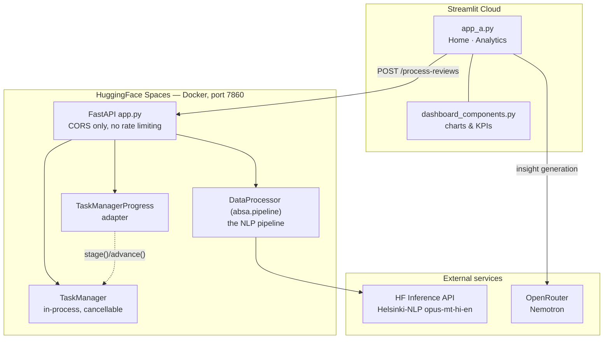

# Insights — Aspect-Based Sentiment Analysis Platform

**A technical reference for the system as it is actually built.**

This document describes the current architecture, module-by-module responsibilities, tech stack, and operational context of the `insights` repository. It is written for someone who needs to *work on* the system — extend it, deploy it, or debug it — rather than evaluate it. For the marketing-oriented overview, see [`README.md`](README.md).

> **Accuracy note:** everything below was derived by reading the source in this working tree (parent repo `benchmark/absa-baseline`, nested `ABSA/` repo `fix/silent-fallback`). Where the code and older docs disagree, this document follows the code, and the disagreement is called out in [Known Drift & Gotchas](#12-known-drift--gotchas). Phase A of the refactor removed the Redis/MongoDB/admin/telemetry/async-queue subsystems described in earlier revisions of this document; if you're looking for them, they're gone, not moved.

---

## Table of Contents

1. [What the system does](#1-what-the-system-does)
2. [Context: why it is split in two](#2-context-why-it-is-split-in-two)
3. [Repository layout](#3-repository-layout)
4. [High-level architecture](#4-high-level-architecture)
5. [Request lifecycle](#5-request-lifecycle)
6. [The NLP pipeline, stage by stage](#6-the-nlp-pipeline-stage-by-stage)
7. [Backend module reference (`ABSA/`)](#7-backend-module-reference-absa)
8. [Frontend module reference (`streamlit-deployment/`)](#8-frontend-module-reference-streamlit-deployment)
9. [Data contracts](#9-data-contracts)
10. [Tech stack](#10-tech-stack)
11. [Configuration & environment](#11-configuration--environment)
12. [Known drift & gotchas](#12-known-drift--gotchas)
13. [Running it locally](#13-running-it-locally)
14. [Extension points](#14-extension-points)

---

## 1. What the system does

The platform ingests a CSV of customer reviews and returns **aspect-level** sentiment rather than a single score per review. One review such as *"Battery is great but delivery took two weeks"* produces two independent verdicts — `Battery → Positive`, `Delivery → Negative` — plus an intent label, a confidence score, and a place in several aggregate analyses.

Concretely, one processing run yields:

| Output | Shape | Produced by |
|---|---|---|
| Per-review records | DataFrame, one row per review | `DataProcessor.process_uploaded_data` |
| Aspect-level records | DataFrame, one row per *(review, aspect)* pair | same, reshape step |
| Mixed-sentiment reviews | Reviews containing both Positive and Negative aspects | same, reshape step |
| Areas of improvement | Ranked table by `priority_score` | `AspectAnalytics.calculate_aspect_scores` |
| Strength anchors | Ranked table by `strength_score` | same |
| Aspect co-occurrence graph | NetworkX graph, nodes = aspects, edges = co-mentions | `AspectAnalytics.calculate_aspect_cooccurrence` |
| Sentiment spike alerts | Week-over-week negativity jumps per aspect | `AspectAnalytics.detect_sentiment_spikes` |
| LLM narrative insights | Markdown from an LLM | Frontend, `generate_llm_insights` |

The distinguishing capability is the **aspect-level reshape**: because the pipeline emits one row per aspect mention, the dashboard can do multi-aspect relationship analysis (co-occurrence, mixed sentiment, per-aspect drill-down) that a review-level dataset cannot support.

---

## 2. Context: why it is split in two

The system is deliberately split across **two deployment targets with two separate hosting providers**, and nearly every architectural decision follows from that split:

- **PyABSA requires the full PyTorch + Transformers stack** (~1.5 GB of dependencies plus a downloaded model checkpoint). That does not fit comfortably in Streamlit Cloud's free tier.
- **Streamlit Cloud is excellent at hosting the UI** and free for public apps.

So the ML lives in a Docker container on **HuggingFace Spaces** (`parthnuwal7/ABSA`, port 7860), and the dashboard lives on **Streamlit Cloud**, talking to the backend over REST. The frontend's `requirements.txt` deliberately contains **no ML libraries at all** — it is ~80 MB instead of ~1.5 GB, and it comments on this fact in the file itself.

A consequence worth internalising: **the frontend never computes sentiment.** It is a rendering and orchestration layer over a remote API response. All the analysis logic that matters lives in the `ABSA/src/absa/` package, coordinated by `absa.pipeline.DataProcessor`.

A second consequence: `ABSA/` is a **nested, independent git repository** tracked in the parent repo as a gitlink (mode `160000`), whose `origin` is the HuggingFace Space itself. Pushing the backend deploys it. The parent repo does not contain the backend's file history.

---

## 3. Repository layout

```
insights/
├── ABSA/                              ← nested git repo → HF Space (deploys on push)
│   ├── app.py                         FastAPI application (the deployed entrypoint)
│   ├── api_server.py                  thin re-export of app.py (see §12)
│   ├── task_manager_progress.py       adapter: absa.progress.ProgressReporter → TaskManager
│   ├── validate_setup.py              preflight checker for env vars + /health
│   ├── Dockerfile                     python:3.10-slim, installs git+git-lfs, CMD python app.py
│   ├── requirements.txt               the only requirements file — full ML stack, load-bearing pins
│   ├── .streamlit/                    config.toml + secrets.toml.template
│   ├── PYABSA_FIX.md                  deployment notes on getting PyABSA to load
│   ├── tests/                         pytest suite for the absa package
│   └── src/
│       ├── absa/                      ★ the NLP pipeline package
│       │   ├── pipeline.py            DataProcessor — coordinates the stages below
│       │   ├── validation.py          DataValidator — CSV schema + cleaning
│       │   ├── translation.py         TranslationService — HF Inference API (opus-mt-hi-en)
│       │   ├── intent.py              IntentClassifier — keyword rules + severity scoring
│       │   ├── extraction.py          ABSAProcessor — PyABSA aspect/sentiment extraction
│       │   ├── analytics.py           AspectAnalytics — priority/strength scores, graphs, alerts
│       │   ├── aspect_canonical.py    surface-form normalization (case, plurals, articles)
│       │   ├── config.py              Settings — validated-at-startup env config
│       │   ├── progress.py            ProgressReporter protocol (dependency-free by design)
│       │   └── __init__.py            pyabsa/pandas import-order preload guard (untouchable)
│       └── utils/
│           └── task_manager.py        in-process task registry + cooperative cancellation
│
├── streamlit-deployment/              ← deployed to Streamlit Cloud
│   ├── app_a.py                       ★ the dashboard (Home + Analytics pages)
│   ├── dashboard_components.py        chart + KPI builders used by the Analytics page
│   ├── diagnostic_component.py        aspect diagnostics panel (call site commented out)
│   ├── requirements.txt               UI-only dependencies, no ML
│   ├── AI_INSIGHTS_SETUP.md           OpenRouter setup guide
│   └── test_data_*.csv                3 bundled sample datasets
│
├── requirements.txt                   full local/dev stack (superset of both)
├── insights_arc.png                   architecture diagram image
├── logs.md                            captured PyABSA checkpoint-loading log
└── README.md                          overview-oriented readme
```

**Two requirements files, two purposes.** Root = local development with everything. `ABSA/requirements.txt` = the container image and the only file the backend installs from — it carries load-bearing version pins (`update_checker<1.0`, `spacy>=3.7,<3.9`) that a stale duplicate previously undermined. `streamlit-deployment/requirements.txt` = the Streamlit Cloud slug. They are intentionally not unified.

---

## 4. High-level architecture



### Layer responsibilities

| Layer | Where | Owns |
|---|---|---|
| **Presentation** | `app_a.py`, `dashboard_components.py` | Upload, filtering, ~15 chart types, CSV export |
| **API** | `app.py` | Request validation (Pydantic), timeout budgeting, thread offload, response serialization, CORS |
| **Orchestration** | `task_manager.py`, `task_manager_progress.py` | Task IDs, progress %, cooperative cancellation |
| **Pipeline** | `absa/pipeline.py` and siblings | Validation, translation, ABSA, intent, analytics |

There is no rate limiting, telemetry, admin API, Redis, MongoDB, or async job queue in the current tree — all of that was removed in Phase A. See [§12](#12-known-drift--gotchas) if you're relying on old documentation that still describes them.

---

## 5. Request lifecycle

The **synchronous path is the one the dashboard actually uses.** Walking it end to end:

1. **Upload.** The user picks a CSV or one of three bundled samples. The frontend backfills missing optional columns (`id`, `reviews_title`, `date`, `user_id`) so only `review` is truly required from the user, then converts rows to `ReviewData` records.

2. **Dispatch.** The frontend POSTs to `{BACKEND_API_URL}/process-reviews` with a **900-second client timeout** — deliberately matching the server's absolute ceiling.

3. **CORS only.** `app.py` mounts `CORSMiddleware` with `allow_origins=["*"]`. There is no rate limiting, auth, or per-identity throttling on any endpoint in the current tree.

4. **Task creation.** `TaskManager.create_task` mints a UUID, registers status/progress/stage, and creates a `threading.Event` cancellation flag.

5. **Timeout budgeting.** `calculate_timeout(n) = min(300 + 0.3n, 900)` seconds — a floor of 5 minutes, 0.3 s of headroom per review, hard-capped at 15 minutes.

6. **Execution.** The pipeline runs on a `ThreadPoolExecutor` (`get_settings().max_workers`, default 2) wrapped in `asyncio.wait_for`, so the event loop stays responsive and the timeout is enforceable. On `TimeoutError` the task is marked failed, cleaned up, and a `status: "timeout"` response is returned — not an exception. A `TaskManagerProgress` reporter (`ABSA/task_manager_progress.py`) is passed into `process_uploaded_data` so the pipeline's stage/advance announcements reach the task manager.

7. **Cancellation.** The pipeline checks `task_manager.is_cancelled(task_id)` at every stage boundary and every ABSA batch of 5. On cancellation it deletes intermediate structures, calls `gc.collect()`, and returns `{'status': 'cancelled'}`. This is **cooperative** cancellation — nothing is killed mid-inference; the request is simply abandoned at the next checkpoint. The frontend triggers it via `POST /cancel-task/{task_id}`.

8. **Serialization.** `serialize_for_api` converts DataFrames to `records` dicts and the NetworkX graph via `nx.node_link_data`, then attaches `task_id` and `timeout_used`.

9. **Errors.** An unhandled exception is logged server-side with its full traceback, but the HTTP 500 response body carries only a generic message and an `error_code` — the traceback itself is not returned to the caller.

10. **Rendering.** The frontend parses the payload, normalizes column names, and stashes `processed_data`, `aspect_level_data`, `mixed_sentiment_reviews`, `analysis_summary`, and `aspect_network` in `st.session_state`. Everything the Analytics page draws comes from that session state.

There is only the synchronous path. No async job queue exists in the current tree.

---

## 6. The NLP pipeline, stage by stage

All of this is `DataProcessor.process_uploaded_data`. Note that **intent classification runs before aspect extraction**, not after.

| # | Stage | Implementation | Progress | Notes |
|---|---|---|---|---|
| 1 | **Validate** | `DataValidator.validate_csv` | 5% | Requires `id`, `reviews_title`, `review`, `date`, `user_id`. Rejects empty reviews and unparseable dates. Returns `{'error': [...]}`, no exception. |
| 2 | **Clean** | `DataValidator.clean_data` | — | Coerces dates, strips text, drops null reviews, **de-duplicates on review text**, resets index. Row counts can shrink here. |
| 3 | **Detect + translate** | `TranslationService` | 10–40% | `langdetect` per review; only `hi` is sent to the HF Inference API (`Helsinki-NLP/opus-mt-hi-en`, one call per sentence). 60 s on the first call per process (cold start), 20 s after, up to 3 retries. Falls back to the original text on failure, but logs the first failure (not silent). Batches of 10 reviews, cancellable between batches. |
| 4 | **Classify intent** | `IntentClassifier` | 40% | Keyword rules over 6 intents (`complaint`, `praise`, `question`, `suggestion`, `comparison`, `neutral`). Complaints get `high`/`medium`/`low` severity; praise gets a positivity tier. Confidence is a normalized keyword hit count. |
| 5 | **Extract aspects + sentiment** | `ABSAProcessor` | 50–90% | PyABSA `AspectTermExtraction.AspectExtractor('multilingual')` (FAST-LCF-ATEPC). Batches of 5 for responsive cancellation. Per-review try/except falls back to rules. |
| 5b | *(fallback)* | `_extract_with_fallback` | — | If PyABSA fails to load *or* fails on a review: 14 keyword aspect buckets (OTP/Verification, Login/Account, App Performance, Payment, Quality, Price, Service, Delivery, Design, Performance, Usability, Features, Size, Battery — with Hindi variants) + rule-based polarity, fixed confidence `0.7`. |
| 6 | **Combine** | inline | 90% | Adds `translated_review`, `detected_language`, `intent*`, `aspects`, `aspect_sentiments`, and a majority-vote `overall_sentiment`. |
| 7 | **Analytics** | `AspectAnalytics` | 95–100% | Priority/strength scores, co-occurrence graph, spike detection. Formulae below. |
| 8 | **Reshape** | inline | — | Explodes to one row per *(review, aspect)*; flags reviews holding both Positive and Negative aspects as mixed. |

### Scoring formulae

```
priority_score  = negativity_ratio × frequency × (1 + severity_weight)
strength_score  = positivity_ratio × frequency × (1 + 2 × positivity_ratio)
severity_weight = mean over complaints of {high:3, medium:2, low:1, standard:1}
```

An aspect enters **Areas of Improvement** only above 10% negativity, and **Strength Anchors** only above 30% positivity. Both multiply ratio by raw frequency, so a widely-mentioned aspect outranks a rarely-mentioned one at the same ratio — the ranking is intentionally volume-weighted for business triage.

### Graph and alerting rules

- **Co-occurrence graph** — nodes carry `frequency`, `sentiment_score`, `color`, `positive_pct`, `negative_pct`. Edges are added only at **weight ≥ 2**, so a single coincidental co-mention never draws a line.
- **Spike detection** — needs ≥ 4 mentions and ≥ 14 days of history. Fires when the 7-day mean negative count exceeds the prior 7-day mean by **>50% *and* by ≥ 2 absolute complaints** — the absolute floor exists to suppress noise like 1 → 2. Severity is `high` above 100% growth, else `medium`.

### The LLM layer (frontend-side)

Narrative insights are generated in the **frontend**, not the pipeline, in `generate_llm_insights`:

- Provider **OpenRouter**, model **`nvidia/nemotron-3-nano-30b-a3b:free`**, `temperature 0.7`, `max_tokens 800`, 30-second timeout.
- `prepare_analysis_context` compresses aspect-level data into a compact text brief: totals, top-8 aspects with sentiment percentages, top-5 co-mention pairs, mixed-sentiment count. **Raw review text is not sent** — only aggregates.
- Without `OPENROUTER_API_KEY` the function returns `""` and the UI falls back to `generate_rag_insights`, a deterministic pattern-based generator capped at 6 insights. The LLM is an enhancement, never a dependency.

---

## 7. Backend module reference (`ABSA/`)

### `app.py` — FastAPI application

Entry point (`CMD ["python", "app.py"]` → uvicorn on `0.0.0.0:7860`). Mounts CORS only (`allow_origins=["*"]`) — there is no rate-limiting middleware or admin router in the current tree. The `DataProcessor` is created **lazily** by `get_processor()` so container startup isn't blocked by loading the PyABSA checkpoint. `api_server.py` is a thin re-export (`from app import app`) kept only so `uvicorn api_server:app` still works; there is exactly one implementation.

**Endpoints, from the route decorators in `app.py`:**

| Method | Path | Purpose |
|---|---|---|
| GET | `/` | Liveness stub |
| GET | `/health` | Reports translator and ABSA model availability |
| POST | `/process-reviews` | **Synchronous pipeline** — the path the dashboard uses |
| POST | `/cancel-task/{task_id}` | Request cooperative cancellation |
| GET | `/task-status/{task_id}` | Progress, stage, message |
| POST | `/cancel-user-tasks/{user_id}` | Cancel all of a user's active tasks |
| GET | `/user-tasks/{user_id}` | List a user's tasks |
| GET | `/task-stats` | Aggregate counts by status and user |
| POST | `/cleanup-old-tasks` | Evict finished tasks older than N hours |

There is no `/submit-job`, `/job-status`, `/log-session`, `/log-event`, or `/admin/*` — the async job queue, telemetry, and admin-metrics subsystems that used to expose them were removed in Phase A.

### `src/absa/` — the pipeline package

Nine sibling modules plus `__init__.py`, coordinated by `pipeline.DataProcessor`; see [§6](#6-the-nlp-pipeline-stage-by-stage) for the stage-by-stage behaviour.

| Module | Class / role |
|---|---|
| `pipeline.py` | `DataProcessor` — coordinates every stage below |
| `validation.py` | `DataValidator` — CSV schema check + cleaning |
| `translation.py` | `TranslationService` — HF Inference API, `opus-mt-hi-en` |
| `intent.py` | `IntentClassifier` — keyword rules + severity/positivity scoring |
| `extraction.py` | `ABSAProcessor` — PyABSA aspect/sentiment extraction, batched with per-review fallback |
| `analytics.py` | `AspectAnalytics` — priority/strength scores, co-occurrence graph, spike detection |
| `aspect_canonical.py` | Surface-form normalization (case, plurals, articles, punctuation) |
| `config.py` | `Settings` — env config, validated once at startup via `get_settings()` |
| `progress.py` | `ProgressReporter` protocol + `NullProgress`/`RecordingProgress` — no dependency on `utils` |
| `__init__.py` | pyabsa/pandas import-order preload guard — **do not touch** |

### `src/utils/task_manager.py` — in-process task registry

Thread-safe (`threading.Lock`) dict of tasks plus a `threading.Event` per task as the cancellation flag. Tracks `status`, `stage`, `progress`, timestamps, and messages; supports per-user cancellation and age-based cleanup. **Process-local** — it does not survive a restart and does not span replicas.

### `task_manager_progress.py` — API-layer progress adapter

`TaskManagerProgress` implements `absa.progress.ProgressReporter` (`stage()`/`advance()`) by forwarding to `TaskManager.update_task`. It lives beside `app.py`, not inside the `absa` package, because `absa.progress` is deliberately dependency-free and must not import `utils.task_manager`. `app.py` constructs one per request and passes it into `process_uploaded_data`.

### Supporting scripts

- **`validate_setup.py`** — preflight checker: required/optional env vars present, `/health` responding. Run this first when something is misbehaving.

---

## 8. Frontend module reference (`streamlit-deployment/`)

### `app_a.py` — the dashboard

Two pages via `streamlit-option-menu` (`options=["Home", "Analytics"]`):

**🏠 Home** — data source selection (upload vs. three bundled samples), preview, `🚀 Process Reviews with AI`, a debug expander showing the exact API request, then quick KPIs and aspect-level statistics after completion. Only `review` is genuinely required in an uploaded CSV; the rest is backfilled.

**📈 Analytics** — enhanced KPI cards over three tabs, each with **independent filter state** (deliberate: filters in one tab don't disturb another):

- **Overview** — sentiment pie, intent×aspect and sentiment×aspect heatmaps, review timeline, priority leaderboard, co-occurrence heatmap, confidence funnel, plus filtered CSV export.
- **Multi-Aspect Analysis** — operates on the aspect-level DataFrame: relationship patterns, mixed-sentiment inspection, and the LLM insight panel. Degrades with a clear warning if the payload predates aspect-level output.
- **Deep Dive** — pick an aspect, see every review mentioning it with per-mention sentiment, mention/positive/negative/confidence metrics, and CSV export.

There is no Admin page. The backend's admin-metrics endpoints and the telemetry that fed them were removed in Phase A, and this page went with them.

Also holds `SessionManager` (lightweight, `st.session_state`-only — **no server-side persistence**; refreshing the browser loses history), `normalize_backend_columns` for schema tolerance across backend versions, and standalone chart builders including the WordCloud and the Plotly aspect-network renderer.

### `dashboard_components.py`

Twelve pure builders — `extract_aspects_list`, `get_all_unique_aspects`, `get_top_aspects_by_frequency`, `calculate_kpi_metrics`, `create_enhanced_kpi_cards`, and the seven Plotly figures listed above. `extract_aspects_list` is the load-bearing one: aspects arrive variously as lists, stringified lists, or scalars depending on serialization path, and it normalizes all of them.

### `diagnostic_component.py`

`show_aspect_diagnostics` — an aspect-extraction debugging panel. **Currently inactive**: its call site at `app_a.py:1675-1676` is commented out.

`frontend_helpers.py` no longer exists — it held only device-id and telemetry helpers with zero remaining importers and was deleted.

### Sample data

`test_data_ecommerce.csv` (22 reviews), `test_data_restaurant.csv` (15), `test_data_app_reviews.csv` (30). Each mixes positive/negative/neutral, includes Hindi reviews, and contains deliberate mixed-sentiment cases so the multi-aspect features have something to show without an upload.

---

## 9. Data contracts

### Input CSV

| Column | Required by backend | Required by UI | Notes |
|---|---|---|---|
| `id` | ✅ | auto-filled | Sequential if absent |
| `reviews_title` | ✅ | auto-filled | `"Review {id}"` if absent |
| `review` | ✅ | ✅ | The only genuinely mandatory column |
| `date` | ✅ | auto-filled | Today if absent; must parse |
| `user_id` | ✅ | auto-filled | `"user_{id}"` if absent |

### `POST /process-reviews`

```jsonc
// request
{
  "data": [
    { "id": 1, "reviews_title": "Great", "review": "Battery life is amazing!",
      "date": "2024-01-15", "user_id": "u1" }
  ],
  "options": { "include_translation": true, "include_aspects": true },
  "user_id": "demo_user"
}

// response
{
  "status": "success",           // | "cancelled" | "timeout"
  "data": {
    "processed_data": [ /* one row per review */ ],
    "aspect_level_data": [ /* one row per (review, aspect) */ ],
    "mixed_sentiment_reviews": [ /* both-polarity reviews */ ],
    "absa_details": [ /* raw extractor output */ ],
    "areas_of_improvement": [ /* ranked by priority_score */ ],
    "strength_anchors": [ /* ranked by strength_score */ ],
    "aspect_network": { "nodes": [], "links": [] },   // nx.node_link_data
    "sentiment_alerts": [ /* spike alerts */ ],
    "summary": {
      "total_reviews": 0, "total_aspects": 0,
      "mixed_sentiment_count": 0, "mixed_sentiment_pct": 0.0,
      "languages_detected": [], "intents_distribution": {},
      "sentiment_distribution": {}, "top_problem_areas": 0,
      "top_strength_anchors": 0, "active_alerts": 0
    },
    "task_id": "uuid", "timeout_used": 300.0
  }
}
```

### `aspect_level_data` row

```jsonc
{
  "review_id": 1, "review": "…", "aspect": "Battery",
  "aspect_sentiment": "Positive",   // Positive | Negative | Neutral
  "overall_sentiment": "Positive",  // majority vote across the review's aspects
  "intent": "praise",               // complaint | praise | question | suggestion | comparison | neutral
  "intent_severity": "high_positive",
  "date": "2024-01-15", "language": "en"
}
```

There is no telemetry event contract — the MongoDB-backed event store and everything that wrote to it were removed in Phase A.

---

## 10. Tech stack

### Backend (`ABSA/requirements.txt`)

| Concern | Choice | Version |
|---|---|---|
| Web framework | FastAPI + Uvicorn | `>=0.104` / `>=0.24` |
| Validation | Pydantic v2 (`model_dump`) | `>=2.0` |
| ABSA model | **PyABSA** ATEPC multilingual (FAST-LCF-ATEPC) | `>=2.4,<3.0` |
| DL runtime | PyTorch | `>=2.0,<2.2` |
| Transformers | HuggingFace Transformers | `>=4.30,<4.37` |
| Tokenization | sentencepiece, sacremoses | — |
| Vector ops | faiss-cpu | `>=1.7.4` |
| Language ID | langdetect | `>=1.0.9` |
| Data | pandas / numpy / scikit-learn | `<2.1` / `<1.26` / `<1.4` |
| Graphs | NetworkX | `>=3.0` |
| NLP infra pins | `update_checker<1.0`, `spacy>=3.7,<3.9` | load-bearing — see the comments in `requirements.txt` |
| Runtime | Python 3.10-slim, Docker | — |

Version ceilings are load-bearing — PyABSA 2.4 is sensitive to the Transformers and PyTorch versions it sits on. Loosen them only with a deliberate test. There is no Redis or MongoDB client in this list; both services were removed in Phase A.

### Frontend (`streamlit-deployment/requirements.txt`)

Streamlit, Plotly, pandas, numpy, requests, `streamlit-option-menu`, `streamlit-aggrid`, NetworkX, WordCloud, Matplotlib, `python-dotenv`, Pillow, openpyxl. **No ML libraries** — that omission is the whole point of the split.

### External services

| Service | Used for | Required? |
|---|---|---|
| HuggingFace Spaces | Backend hosting (Docker, port 7860) | Yes, for the deployed system |
| Streamlit Cloud | Frontend hosting | Yes, for the deployed system |
| HF Inference API | `Helsinki-NLP/opus-mt-hi-en` translation | No — falls back to source text (failure is logged once, not silent) |
| OpenRouter | LLM narrative insights | No — pattern-based fallback |

**Every external service degrades rather than fails.** Only the two hosting platforms are hard requirements. This is a consistent, deliberate property of the design, and the single most useful thing to know when debugging: a missing key produces quieter output, not an error. (MongoDB, Redis, and IPinfo were used by subsystems removed in Phase A; they are not part of the current system at all, degraded or otherwise.)

---

## 11. Configuration & environment

### Backend (`ABSA/.env`, see `ABSA/.env.example`)

```env
HF_TOKEN=                        # HF Inference API (translation); required unless...
ABSA_ALLOW_NO_TRANSLATION=0      # ...this is set to 1, to run deliberately without translation
MAX_WORKERS=2                    # ThreadPoolExecutor size, read via Settings.max_workers
OPENROUTER_API_KEY=              # read into Settings.llm_api_key; not yet consumed downstream
LLM_MODEL=nvidia/nemotron-3-nano-30b-a3b:free   # read into Settings.llm_model
ABSA_ALLOW_KEYWORD_FALLBACK=false  # opt-in only; keyword extraction measured far worse than PyABSA
```

All of these are read once, eagerly, and validated by `absa.config.Settings.from_env()` at import time (`app.py` calls `get_settings()` before anything else) — a missing `HF_TOKEN` fails the process at startup instead of silently degrading mid-run.

### Frontend (`streamlit-deployment/.env`, see `streamlit-deployment/.env.example`)

```env
OPENROUTER_API_KEY=your_openrouter_api_key_here  # LLM insights; omit for pattern-based fallback
BACKEND_API_URL=http://localhost:7860            # defaults to local; point at the deployed Space to use it
```

### Deployment

| Target | Mechanism |
|---|---|
| Backend | `git push` inside `ABSA/` → HF Space rebuilds from the `Dockerfile`. Secrets set in Space settings. |
| Frontend | Streamlit Cloud tracks the repo; main file `streamlit-deployment/app_a.py`. Secrets in app settings. |

The Dockerfile installs `git` and `git-lfs` explicitly — PyABSA needs them to fetch checkpoints at runtime. `PYABSA_FIX.md` and `logs.md` document that episode; `logs.md` is a captured checkpoint-resolution log, useful when the model silently falls back to rules.

---

## 12. Known drift & gotchas

Real observations from the current tree. Nothing here is fatal to the working system, but each will cost time if discovered the hard way.

1. **There is no rate limiting, telemetry, or admin API.** Earlier revisions of this document described `RateLimitMiddleware`, `redis_service.py`, `mongodb_service.py`, `ip_location_service.py`, `admin_endpoints.py`, and an async job queue (`task_queue.py`, `/submit-job`, `/job-status/{id}`). All of it was removed in Phase A; `app.py` mounts CORS and nothing else, and `src/utils/` now contains only `task_manager.py`. If you're chasing one of those names, it isn't hiding somewhere else — it's gone.

2. **`.env` files may be present in a local working tree** at `ABSA/.env` and `streamlit-deployment/.env`. They are gitignored, but if they exist locally they hold real credentials — worth rotating if this tree has ever been shared or archived.

3. **Performance figures in the top-level `README.md`-style marketing copy are unverified.** Claims like "~2-3 minutes for 1000 reviews" appear nowhere in the code as a guarantee. The only real limit is the `min(300 + 0.3n, 900)` second timeout in `calculate_timeout`.

4. **Sessions are not persisted.** `SessionManager` in the frontend writes to `st.session_state` only. A browser refresh discards all analysis history. Navigation is Home / Analytics only — there is no History or Admin page.

5. **`TaskManager` state is process-local.** Task IDs, progress, and cancellation flags live in memory. They do not survive a container restart, and they would not work correctly across multiple replicas.

6. **`_get_hf_token`'s docstring in `translation.py` still says "from environment or Streamlit secrets".** The code only calls `absa.config.get_settings().hf_token` — there is no `st.secrets` lookup left in the backend. Harmless (the docstring undersells nothing that matters), but worth knowing if you go looking for a `st.secrets` fallback that isn't there.

---

## 13. Running it locally

### Backend

```bash
cd ABSA
pip install -r requirements.txt          # ~1.5 GB; torch + pyabsa
cp .env.example .env                     # then fill in what you have

python validate_setup.py                 # preflight: env vars, /health
python app.py                            # uvicorn on http://0.0.0.0:7860
```

Docs at `http://localhost:7860/docs`. The **first** ABSA request downloads the PyABSA checkpoint and takes several minutes; watch for `✅ PyABSA model loaded successfully`. If you see `⚠️ Using fallback method for aspect extraction`, the model did not load and you are getting keyword-based results — check that `git`/`git-lfs` are on `PATH` (see `PYABSA_FIX.md`).

Via Docker, which matches the deployed environment more closely:

```bash
cd ABSA
docker build -t absa-backend .
docker run -p 7860:7860 --env-file .env absa-backend
```

### Frontend

```bash
cd streamlit-deployment
pip install -r requirements.txt          # ~80 MB, UI only
streamlit run app_a.py                   # http://localhost:8501
```

To point at a local backend, set `BACKEND_API_URL=http://localhost:7860` in `streamlit-deployment/.env` (read at `app_a.py:45`; defaults to `http://localhost:7860` already, so a deployed Space needs the override, not the other way around).

There is no standalone admin dashboard in the current tree — `admin_dashboard.py` doesn't exist.

### Running the test suite

```bash
cd insights                                            # repo root
.venv-bench/Scripts/python.exe -m pytest ABSA/tests/ -v  # or your own venv's python
```

The suite covers aspect canonicalization, batched extraction, extraction provenance, config validation, translation, progress reporting, import hygiene (no stray Streamlit imports in the backend), and the absence of the removed Redis/Mongo modules. The three sample CSVs in `streamlit-deployment/` remain useful as an end-to-end smoke test on top of that — process each one and confirm the Analytics tab populates.

---

## 14. Extension points

Where to work, given the structure above:

| Goal | Where to go |
|---|---|
| Add a language | `TranslationService.process_reviews` — currently gates on `lang == 'hi'`; widen the condition and pick the correct direction-appropriate model. |
| Swap the ABSA model | `ABSAProcessor._load_pyabsa_model` / `_extract_with_pyabsa`. Keep the return schema (`aspects`, `sentiments`, `positions`, `confidence_scores`) and everything downstream keeps working. |
| Add aspect keywords | `_extract_simple_aspects` — the fallback taxonomy; also worth extending because it runs whenever PyABSA misses. |
| Change ranking | `AspectAnalytics.calculate_aspect_scores` — the two formulae and the 10% / 30% inclusion thresholds. |
| Tune alerting | `detect_sentiment_spikes` — `window_days`, the 1.5× ratio, and the ≥ 2 absolute floor. |
| New intent | `IntentClassifier.INTENT_KEYWORDS`; severity tiers are only defined for `complaint` and `praise`. |
| New chart | Add a builder to `dashboard_components.py`, call it from the relevant tab in `app_a.py`. |
| Wire pipeline progress through further | `ABSAProcessor.extract_aspects_and_sentiments` doesn't currently receive the `ProgressReporter`, only `task_id` — threading it through would let `progress.advance()` report per-batch extraction progress too. |
| Change the LLM | `LLM_MODEL` at `app_a.py:48` and the prompt in `generate_llm_insights`. |
| Add telemetry, rate limiting, or an admin API | These were removed wholesale in Phase A. Reintroducing any of them is a new subsystem, not a bug fix — there's nothing partial left to build on. |

---

## License

MIT — see [`LICENSE`](LICENSE).

## Acknowledgments

[PyABSA](https://github.com/yangheng95/PyABSA) · [Helsinki-NLP opus-mt](https://huggingface.co/Helsinki-NLP/opus-mt-hi-en) · [HuggingFace](https://huggingface.co/) · [Streamlit](https://streamlit.io/) · [Plotly](https://plotly.com/) · [OpenRouter](https://openrouter.ai/)
